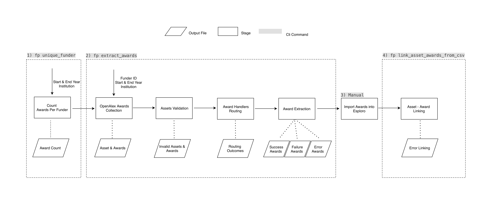
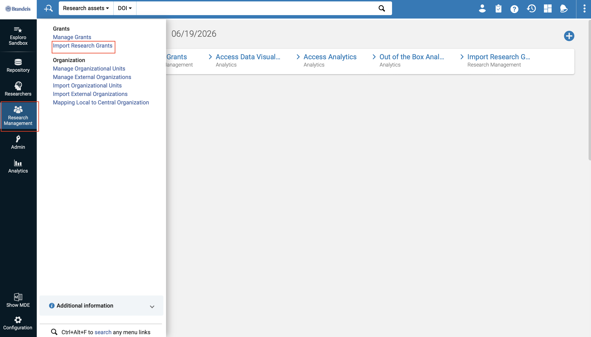
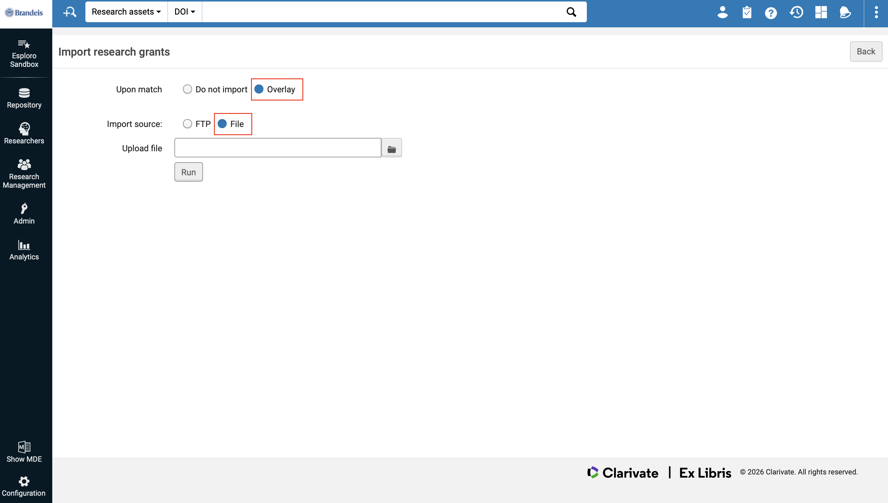

# Funder API Pipeline

## Problem Statement 
Many colleges and universities across the United States use Ex Libris's research information management platform, **Esploro**, to manage research outputs (assets) and sponsored funding records (awards/grants). 

However, detailed award information—such as funding amounts, project dates, and sponsor details—associated with research assets is often difficult to obtain and maintain. In many institutions, this information relies on manual entry by faculty members or scholarly librarians, leading to data inconsistencies, incomplete records, and limited transparency.

To address these challenges, we developed an automated ETL (Extract, Transform, Load) data pipeline operated through command-line interface (CLI) commands. The pipeline automatically extracts award information from funder APIs or retrieves data directly from funder websites through web scraping. The extracted data is then transformed into a standardized, structured format, imported into Esploro and linked with associated assets, enabling seamless integration with existing research records.

## Overview of the Pipeline

The pipeline currently supports **97** of the most commonly used funding agencies. 

It is designed with extensibility in mind, allowing additional funders to be integrated with minimal effort as needed. A complete list of the currently supported funders can be found in the [`current_funder.py`](https://github.com/FrankYiquan/Grant_Extract/blob/main/src/funder_pipeline/utils/current_funder.py) file.

## CLI Commands

The project installs a console command named `fp` (short for "funder pipeline")

| Command | Meaning | Example |
| --- | --- | --- |
| `fp unique_funder` | Find unique funders for an institution and year range, then write a funder count CSV. | `fp unique_funder --start_year 2018 --end_year 2024` |
| `fp award_per_funder` | Fetch OpenAlex assets and award IDs for one supported funder in a year range. | `fp award_per_funder --funder_id F4320306076 --start_year 2018 --end_year 2024` |
| `fp extract_awards` | Run the main extraction pipeline for one funder: collect awards, validate Esploro assets, route awards to handlers, extract award metadata, and write import/linking outputs. | `fp extract_awards --funder_id F4320306076 --start_year 2018 --end_year 2024` |
| `fp extract_one_award` | Extract metadata for a single award. Useful for testing, debugging, and backfills. | `fp extract_one_award --funder_id F4320306076 --award_id 1144085` |
| `fp extract_one_award --skip_routing` | Extract one award with the handler for the provided funder ID, bypassing routing rules. | `fp extract_one_award --funder_id F4320306076 --award_id 1144085 --skip_routing` |
| `fp get_asset_id` | Look up an Esploro asset ID by DOI. Accepts either a plain DOI or a `https://doi.org/` URL. | `fp get_asset_id --doi 10.1038/s41467-020-17432-w` |
| `fp link_assets_by_arg` | Link one Esploro asset to one or more award IDs through the Ex Libris API. Uses sandbox unless `--production` is supplied. | `fp link_assets_by_arg --asset_id 9924303240601921 --award_ids 1144085 AST-1337663` |
| `fp link_asset_awards_from_csv` | Link asset-award pairs from `outputs/award_asset_links/<name>.csv`. Uses sandbox unless `--production` is supplied. | `fp link_asset_awards_from_csv --dir "National Science Foundation_2018_2024_award_asset_links"` |
| `fp clean_outputs` | Delete files inside `outputs/` and all subfolders while preserving the folder structure. | `fp clean_outputs` |
| `fp clean_outputs --dry_run` | Preview which files would be deleted without removing anything. | `fp clean_outputs --dry_run` |

Common arguments:

- `--start_year` and `--end_year` are required for funder discovery and extraction commands.
- `--institutions_id` is the institutions id in OpenAlex. It's optional and defaults to `I6902469` (Brandeis University).
- `--funder_id` must be one of the supported OpenAlex funder IDs configured in [`current_funder.py`](https://github.com/FrankYiquan/Grant_Extract/blob/main/src/funder_pipeline/utils/current_funder.py).
- Add `--production` only when you intend to write to the production Ex Libris/Esploro environment.

# Pipeline Workflow



# Stage 1: Identify and Rank Funders

### Context

OpenAlex is an open scholarly metadata database that aggregates information from sources such as Crossref and ORCID. Its API enables users to retrieve and filter research outputs and their associated awards based on institutions, publication years, and other metadata fields.

This stage queries OpenAlex to identify all funders associated with a given institution during a specified time period. The pipeline counts the number of awards linked to each funder, ranks funders by award count, and generates key metadata required for Stage 2, including OpenAlex institution IDs and funder IDs.

### Command

Run:

```bash
fp unique_funder --start_year <start_year> --end_year <end_year> --institutions_id <institution_id>
```

For Brandeis University, the `--institutions_id` argument can be omitted because Brandeis University is used as the default institution:

```bash
fp unique_funder --start_year <start_year> --end_year <end_year>
```

### Output

```csv
# CSV file in outputs/funder_count

funder_name,funder_openalex_id,count,is_implemented

Science and Technology Facilities Council,F4320334632,6045,True
...
```

### Output Columns

| Column               | Description                                                                                                                                                    |
| -------------------- | -------------------------------------------------------------------------------------------------------------------------------------------------------------- |
| `funder_name`        | Name of the funding organization.                                                                                                                              |
| `funder_openalex_id` | OpenAlex identifier for the funder.                                                                                                                            |
| `count`              | Number of awards associated with the funder during the specified time period.                                                                                  |
| `is_implemented`     | Indicates whether funder-specific extraction logic has been implemented in the pipeline. A value of `True` means the funder is currently supported in Stage 2. |

---

# Stage 2: Fetch, Validate, Filter, and Extract Awards

### Context

After identifying funders in Stage 1, run Stage 2 separately for each funder. Processing funders individually makes it easier to monitor progress, inspect logs, identify extraction issues, and perform targeted backfills when necessary.

For each funder, the pipeline:

1. Retrieves associated awards from OpenAlex.
2. Validates whether linked assets exist in Esploro.
3. Routes awards to the appropriate funder-specific handler.
4. Extracts award metadata from funder APIs or websites.
5. Generates XML files ready for Esploro import.
6. Produces award-to-asset linking files used in Stage 4.

### Command

Run:

```bash
fp extract_awards --funder_id <funder_id> --start_year <start_year> --end_year <end_year> --institutions_id <institution_id>
```

If you are running for Brandeis University, you can omit `--institutions_id`:

```bash
fp extract_awards --funder_id <funder_id> --start_year <start_year> --end_year <end_year>
```

### Output

Each time this command is executed, log files are generated for every processing stage. These logs make it easier to investigate unexpected results, diagnose failures, and perform targeted fixes.

---

## Sub-Stage 2.1: Retrieve Awards

The pipeline queries OpenAlex and retrieves all awards that match the provided institution, funder, and year filters.

```csv
# CSV file in outputs/award_ids

openAlex_id,doi,title,publication_year,funder_name,funder_openAlex_id,award_id

https://openalex.org/W4280589633,https://doi.org/10.3847/2041-8213/ac6674,First Sagittarius A* Event Horizon Telescope Results. I. The Shadow of the Supermassive Black Hole in the Center of the Milky Way,2022,Space Telescope Science Institute,F4320314503,NAS5-26555

...
```

---

## Sub-Stage 2.2: Validate Assets

OpenAlex contains a broader set of research outputs than institutions typically wish to import into Esploro. For example, student-owned publications and their associated awards may not be eligible for inclusion.

To determine whether an asset is valid, the pipeline queries Esploro using the asset DOI. If a matching record exists, the asset is considered valid and its internal Esploro asset ID is retrieved.

The Esploro asset ID serves as the primary identifier in subsequent stages and is later used to create award-to-asset relationships.

Assets that do not exist in Esploro are excluded from further processing, and their associated awards are filtered out.

```csv
# CSV file in outputs/invalid_assets

doi

10.17863/cam.37745
10.3847/2041-8213/ac6672
...
```

---

## Sub-Stage 2.3: Route Awards to the Appropriate Handler

OpenAlex occasionally associates awards with incorrect funders. For example, an NSF award may be incorrectly attributed to the European Commission.

To improve extraction accuracy, the pipeline analyzes award number patterns and other metadata to determine the most likely funder. The award is then routed to the corresponding funder-specific extraction handler.

This routing layer reduces extraction failures caused by incorrect OpenAlex funder assignments.

```csv
# CSV file in outputs/routing_outcomes

award,asset_id,doi,initial_funder_id,initial_funder_name,final_funder_name,final_funder_id,handler,change_handler

AST-1312651,9924117851801921,https://doi.org/10.3847/2041-8213/ab1141,F4320306076,National Science Foundation,National Science Foundation,F4320306076,<function extract_NSF_award at 0x12f3c0720>,False
```

---

## Sub-Stage 2.4: Extract Award Metadata

After routing, each award is processed by a funder-specific handler.

Depending on the funder, the handler may:

* Query a public funder API.
* Scrape the funder's award database.
* Parse award metadata from publicly available records.

The extracted information is standardized into Esploro-compatible XML format for batch import.

The pipeline classifies extraction outcomes into three categories:

* **Success** – Award metadata was successfully extracted.
* **Failure** – Extraction completed but no award metadata could be retrieved.
* **Error** – An exception occurred during extraction.

### Success

```xml
# XML file in outputs/import_awards/success

<?xml version="1.0" encoding="UTF-8"?>
<grants xmlns:xsi="http://www.w3.org/2001/XMLSchema-instance" xsi:noNamespaceSchemaLocation="schema1.xsd">
<grant>
    <grantId>1207704</grantId>
    <grantName>Collaborative Research: Building an Event Horizon Telescope: (Sub)millimeter VLBI from the South Pole Telescope</grantName>
    <funderCode>41___NATIONAL_SCIENCE_FOUNDATION_(ALEXANDRIA)</funderCode>
    <currencyOfAmount>researchgrant.currency.usd</currencyOfAmount>
    <amount>191204</amount>
    <startDate>2012-08-01</startDate>
    <endDate>2015-07-31</endDate>
    <grantURL>https://www.nsf.gov/awardsearch/show-award?AWD_ID=1207704</grantURL>
    <profileVisibility>true</profileVisibility>
    <status>HISTORY</status>
</grant>

...

</grants>
```

### Failure

```csv
# CSV file in outputs/import_awards/failure

award,doi,asset_id

11633006,https://doi.org/10.3847/2041-8213/ab1141,9924117851801921
...
```

### Error

```csv
# CSV file in outputs/import_awards/error

award,doi,asset_id,funder_name,error_type,error_message

MDM-2015-0509,https://doi.org/10.1093/mnras/stab978,9924552855501921,Ministerio de Ciencia e Innovación,ReadTimeoutError,HTTPConnectionPool(host='localhost', port=55730): Read timed out. (read timeout=120)

...
```

The pipeline also generates an award-to-asset mapping file that will be used in Stage 4.

```csv
# CSV file in outputs/award_asset_links

award,doi,asset_id

1207704,https://doi.org/10.3847/2041-8213/ab1141,9924117851801921
0705062,...
```

---

# Stage 3: Import Awards into Esploro

As of May 2026, Esploro does not provide a fully functional public API for award imports.

Instead, awards must be imported through the Esploro administrative interface. The recommended import settings are shown below and should be configured identically in both sandbox and production environments.





---

# Stage 4: Link Awards with Assets

### Context

After awards have been imported into Esploro, they must be linked to the assets they funded.

A single award may be associated with multiple assets, and a single asset may be linked to multiple awards.

Stage 2 generates award-to-asset mapping files that are used by this command to automatically create these relationships within Esploro.

For the `file_dir` argument below, use the filename generated in Stage 2 without the `.csv` extension.

For example, if the file is:

```text
National_Science_Foundation_2018_2024_award_asset_links.csv
```

then the argument should be:

```text
National_Science_Foundation_2018_2024_award_asset_links
```

### Command

```bash
fp link_asset_awards_from_csv --dir <file_dir>
```

Use production only when ready:

```bash
fp link_asset_awards_from_csv --dir <file_dir> --production
```


## Setup

Create the Conda environment:

```bash
conda env create -f environment.yml
```

Activate the environment:

```bash
conda activate Funder_API
```

Deactivate the environment when finished:

```bash
conda deactivate
```

Enter Both the `PRODUCTION_EXLIBRIS_API` and `SANDBOX_EXLIBRIS_API` on [`sqs.config.py`](https://github.com/FrankYiquan/Grant_Extract/blob/main/src/funder_pipeline/utils/sqs_config.py)


## Output Files

Main runtime outputs are written under `outputs/`:

| Path | Contents |
| --- | --- |
| `outputs/funder_count/` | Unique funder counts for an institution and year range. |
| `outputs/award_ids/` | OpenAlex assets and raw funder award IDs for a selected funder. |
| `outputs/invalid_assets/` | DOI values that could not be validated as Esploro assets. |
| `outputs/routing_outcomes/` | Routing decisions showing the initial funder, final funder, handler, and whether routing changed. |
| `outputs/import_awards/success/` | Successfully extracted awards formatted for Esploro import. |
| `outputs/import_awards/failure/` | Awards that were processed but did not return enough metadata to import. |
| `outputs/import_awards/error/` | Awards that raised errors during extraction. |
| `outputs/import_awards/single/` | Output from `extract_one_award`. |
| `outputs/award_asset_links/` | Award-to-asset links used after awards are imported. |
| `outputs/award_asset_links/error/` | Failed award-to-asset link attempts. |

To clear generated output files without deleting the folders, run:

```bash
fp clean_outputs
```

To preview the cleanup first, run:

```bash
fp clean_outputs --dry_run
```

## Project Structure

```text
.
|-- environment.yml
|-- pyproject.toml
|-- docker-compose.yaml
|-- airflow/
|   |-- dags/
|   |-- Dockerfile
|   `-- requirements.txt
|-- outputs/
|   |-- award_asset_links/
|   |-- award_ids/
|   |-- funder_count/
|   |-- import_awards/
|   |-- invalid_assets/
|   `-- routing_outcomes/
`-- src/funder_pipeline/
    |-- main.py
    |-- cli/
    |-- handlers/
    |-- resources/
    |-- stages/
    |   |-- extract/
    |   |-- transform/
    |   `-- load/
    `-- utils/
```

Important modules:

- `src/funder_pipeline/main.py` registers the `fp` CLI and subcommands.
- `src/funder_pipeline/cli/` defines CLI arguments and command registration.
- `src/funder_pipeline/stages/extract/` collects OpenAlex data and validates assets in Esploro.
- `src/funder_pipeline/stages/transform/` routes awards and extracts structured award metadata.
- `src/funder_pipeline/stages/load/` links awards back to Esploro assets through the Ex Libris API.
- `src/funder_pipeline/handlers/` contains funder-specific extraction logic.
- `src/funder_pipeline/utils/current_funder.py` maps supported OpenAlex funder IDs to funder names, routing rules, and handlers.
- `src/funder_pipeline/resources/` contains supporting lookup data, including funder code mappings.
- `airflow/dags/` contains Airflow DAGs for orchestrated ETL runs.

## Adding a Funder Handler

To integrate a new funder-specific handler:

1. Add the handler method in `src/funder_pipeline/handlers/`. The handler should follow the existing handler pattern and return the extracted award metadata for a given award ID.
2. Import the handler function in `src/funder_pipeline/utils/current_funder.py`.
3. Add an entry for the funder in the `current_funder` mapping with:
   - the OpenAlex funder ID
   - the funder name
   - the handler function
   - an award ID regex when the funder has a recognizable award ID pattern
4. Add Funder 41 Code in [`funder_41Code.csv`](https://github.com/FrankYiquan/Grant_Extract/blob/main/src/funder_pipeline/resources/funder_41Code.csv) if the new funder is not part of the list.

## Esploro 41 Code

Esploro assigns a unique 41 code to each funder for internal identification. We maintain a mapping of funders and their corresponding 41 codes in [`funder_41Code.csv`](https://github.com/FrankYiquan/Grant_Extract/blob/main/src/funder_pipeline/resources/funder_41Code.csv). These codes are required when importing awards into Esploro.

The process of matching funders to Esploro 41 codes is maintained in a separate repository. For details on how 41 codes are assigned and managed, please refer to the [`Funder_41_Code_Matching`](https://github.com/FrankYiquan/Funder_41_Code_Matching) repository.